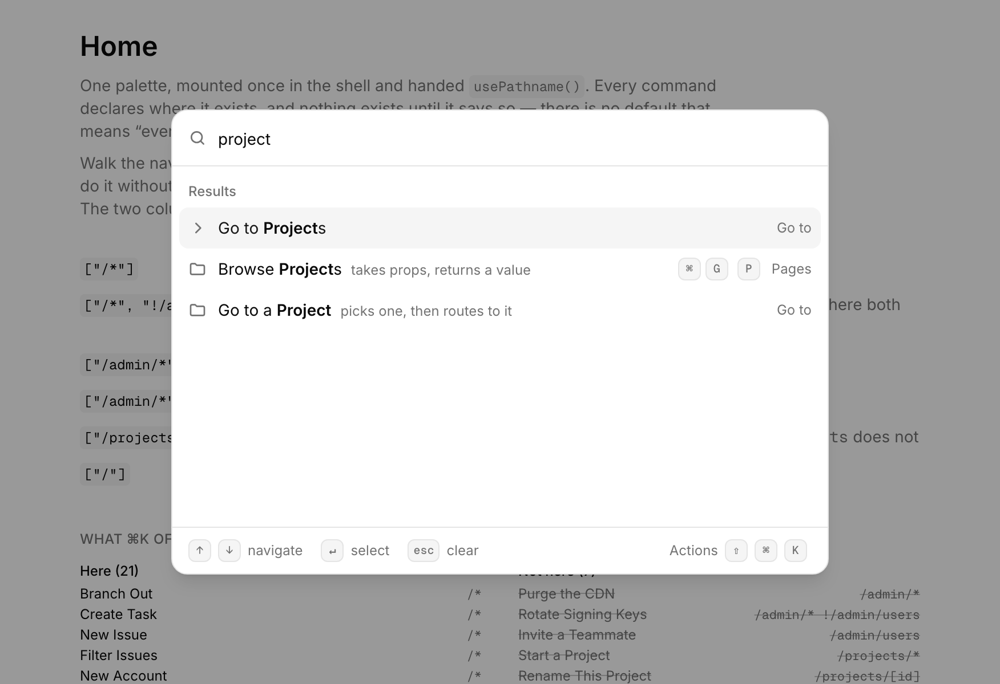
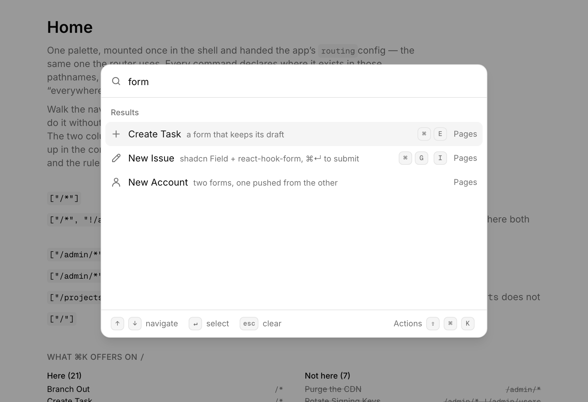
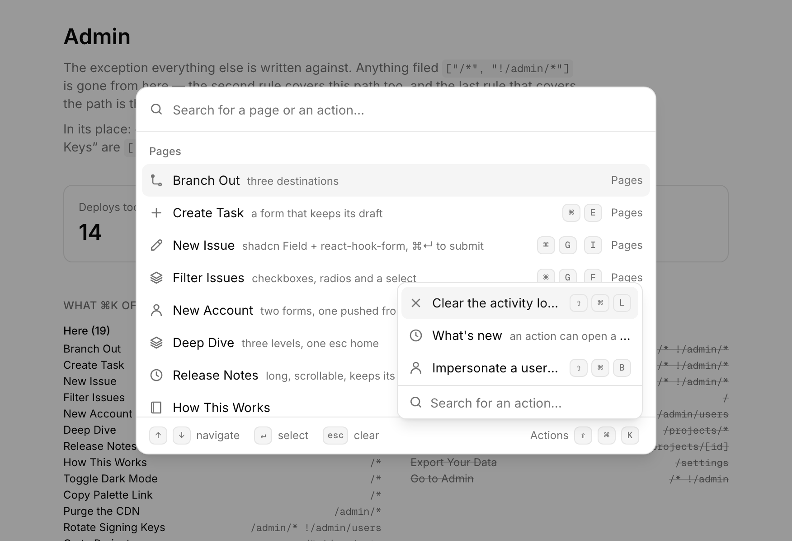
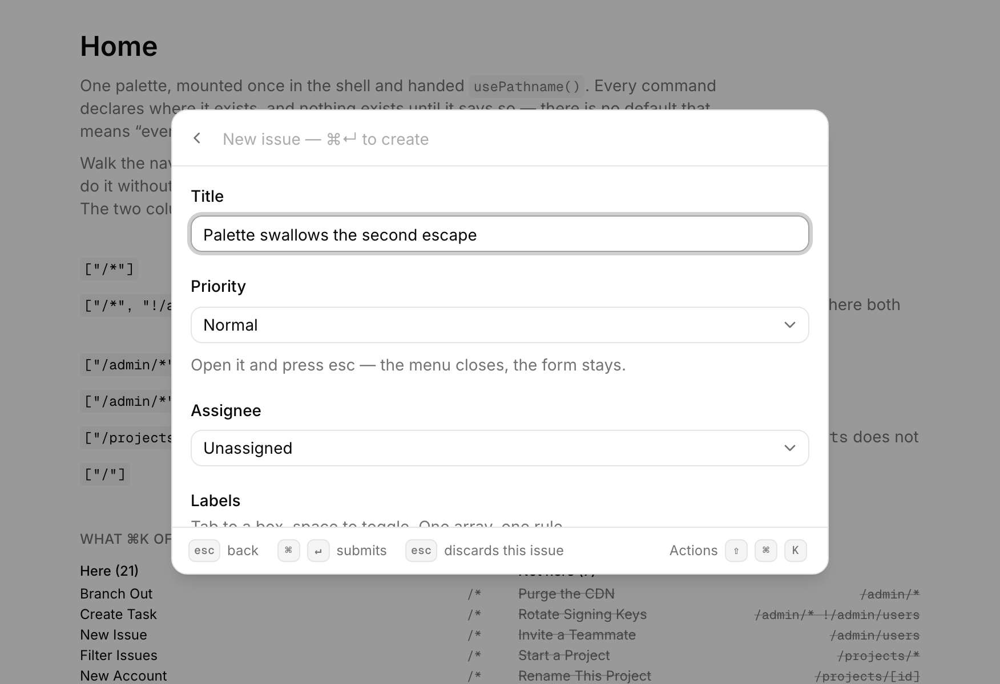
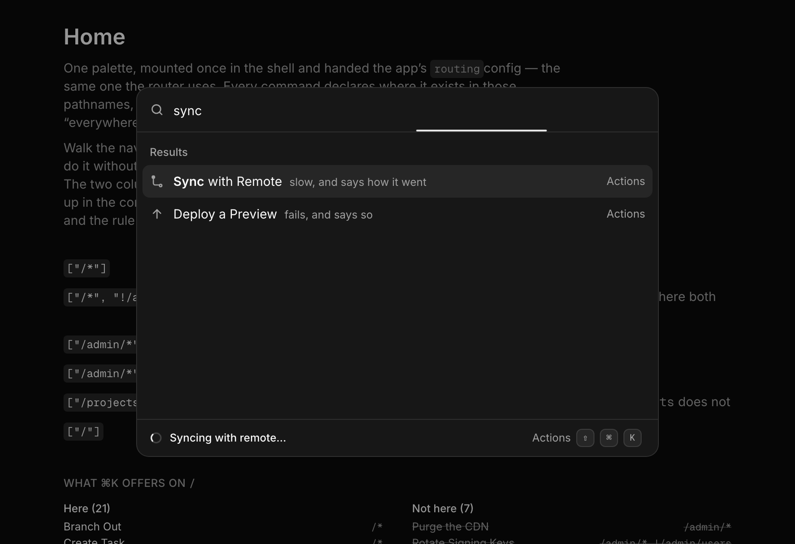
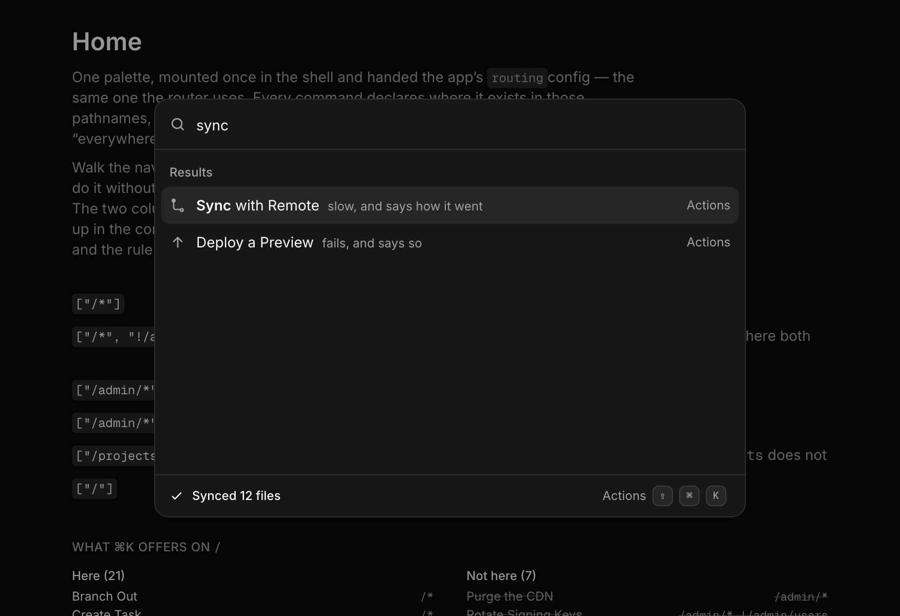

# Command palette

A stacked, keyboard-driven command palette for React — in one folder you copy
into your app. No package to install, no build step, no config. Its only
imports are `react` and, for the ⌘K dialog alone, `radix-ui`.

The thing it does that most palettes don't: **every command declares where it
exists**, so one registry mounted once in the shell can answer to wherever the
user has got to.


This repo is the component plus a small Next.js app to try it in. The component
is [`components/command-palette/`](components/command-palette/); everything else
is the demo.

```bash
npm install
npm run dev     # then press ⌘K
```

---

## Every command says where it exists

`paths` is required of every command. There is no default, because a default is
the question going unasked:

```ts
paths: ["/*"] // everywhere there is
paths: ["/*", "!/admin/*"] // everywhere except the admin area
paths: ["/admin/*"] // /admin, and everything under it
paths: ["/admin/*", "!/admin/users"] // that subtree, less one page
paths: ["/settings"] // exactly one path
paths: ["/projects/[id]"] // one dynamic route: /projects/atlas
```

Nothing is available until a rule says so. `X/*` is the subtree with `X` in it,
which is what makes `"/*"` mean everything by the same reading rather than by a
special case. The last rule that covers the path wins, so a list reads as a
general case and then its exceptions.

One query, two paths — the same registry, the same ⌘K:

| on `/`                                                                   | on `/projects/atlas`                                                                                                |
| ------------------------------------------------------------------------ | ------------------------------------------------------------------------------------------------------------------- |
|  | ![The same search on a project page: two commands scoped to `/projects/[id]` have appeared](docs/paths-project.png) |

"Start a Project" and "Rename This Project" are not greyed out on the left —
they are **not there**. Out of the list, out of the ⌘⇧K panel, and their
shortcuts do nothing. An unavailable command is one the user has no business
seeing, not one to be told they cannot have. "Go to a Project" goes the other
way: it drops out on the right, because you are already on one.

### The pathnames are the router's, and they are checked

`paths` is not `string`. It is the keys of the app's routing config — the
routes the router already knows — so there is no second list to keep in step:

```ts
// i18n/routing.ts
export const routing = defineRouting({
  locales: ["en", "de"],
  defaultLocale: "en",
  pathnames: {
    "/": "/",
    "/projects": { en: "/projects", de: "/projekte" },
    "/projects/[id]": { en: "/projects/[id]", de: "/projekte/[id]" },
    "/admin": { en: "/admin", de: "/verwaltung" },
    "/admin/users": { en: "/admin/users", de: "/verwaltung/benutzer" },
    "/settings": { en: "/settings", de: "/einstellungen" },
  },
})

declare global {
  interface PaletteRoutes {
    path: keyof typeof routing.pathnames
  }
}
```

`"/setttings"` is now a compile error with a "did you mean", rather than a
command that quietly never appears. Wildcards are derived rather than
free-form: `"/admin/*"` compiles because something is declared at or under
`/admin`; `"/billing/*"` does not. Declare nothing and the folder still works —
`paths` just takes any string, because there is no vocabulary to check against.

The same config is the whole of what the palette is told:

```tsx
<CommandPalette commands={commands} routing={routing} />
```

No path is passed in, because a path is the answer to a question the router has
already been asked. The palette asks it itself — next-intl's `usePathname()`,
not `next/navigation`'s, because that one answers with the URL. On
`/de/projekte/atlas` the URL is no use to a rule; the answer the palette gets is
`/projects/[id]`, which is what the rule is written in. **One rule, every
locale.** Switch the demo to `de` and watch the URLs change and the rules not.

The rules are applied where the rows are, so they re-apply as the path moves:
navigate with the palette open and the list rebuilds under you — that is the
middle of the recording above.

## And every command says who it is for

`roles` is required too, and it reads the same way. Nothing until a rule says
so, and `"*"` written out rather than implied:

```ts
roles: ["*"] // everyone there is, signed out included
roles: ["admin"] // admins only
roles: ["admin", "support"] // either one
roles: ["*", "!viewer"] // everyone but viewers
roles: [] // nobody at all
```

A hidden row is hidden the same way a row on the wrong path is: **not there**.
Out of the list, out of the ⌘⇧K panel, shortcut dead. The two rules compose, and
a command has to survive both.

One difference from `paths`, and it is the subject rather than a change of mind.
There, the *last* rule that covers the path wins — a user is in one place, and
`/admin/*` genuinely contains `/admin/users`, so something has to break that
tie. A user holds a *set* of roles, and the rules covering them contain nothing
at all, so "last" would invent a priority out of the order two lines sit in:
for someone holding both admin and viewer, `["admin", "!viewer"]` and
`["!viewer", "admin"]` would mean opposite things. **A deny wins wherever it
sits**, so the list stays the set of names it looks like.

Like the pathnames, the roles are the app's own and they are checked:

```ts
export const ROLES = ["admin", "support", "member", "viewer"] as const

declare global {
  interface PaletteRoles {
    role: (typeof ROLES)[number]
  }
}
```

`roles: ["admn"]` is a compile error. Declare nothing and it takes any string.

What the palette is told is whichever shape the app already has:

```tsx
<CommandPalette commands={commands} routing={routing} roles={session?.user.role} />
```

One role, an array, a `Set`, or `undefined` for a signed-out visitor — it is
normalized once, at the edge. Signed out and not-loaded-yet are the same empty
set on purpose: both hold nothing, and deny-by-default draws both correctly
without a third state. The palette does not fetch, because a set that arrived
late would be rows sliding in under the user's hands a beat after the palette
paints — the greyed-out row this thing refuses to draw, arriving through time
instead of pixels.

Switch the role in the demo header with ⌘K open and watch the list, the panel
and the shortcuts all rebuild.

**It is not authorization.** A `roles` rule decides what is drawn, in a browser
that already has the whole registry. It shapes what the product offers, not what
the server permits — every command that touches anything still has to be
authorized where it runs.

## Search is fuzzy, and it reads more than the title



Not one of those three has "form" in its title — they match on `keywords`. An
untouched list keeps its sections; typing throws the headings away, because
sections are how a list is read at rest and a search is one ranked answer to
what was typed.

Every row carries its section on the right, with the keys beside it wherever
there are keys. The two answer different questions and neither stands in for
the other: the section says what the row _is_, the keys say how to run it
without coming back here.

## Pages are objects, and they stack

There is nothing to call. A page is a plain object with an `id` and a `render`
— a body of your own, **mounted** as a component, so it keeps its own hooks,
state and effects:

```tsx
const projectsPage: Page<{ archived: boolean }, Project> = {
  id: "projects",
  placeholder: "Search projects…",
  render: ({ props, resolve }) => (
    <Projects archived={props.archived} onPick={resolve} />
  ),
}

const project = await nav.push(projectsPage, { archived: false })
```

The two type parameters are what the caller must supply and what the page hands
back. `nav.push` settles with whatever the page resolves — or `undefined` if the
user escaped out of it, which is how a picker and a confirm are the same shape.
A list is not a kind of page but a component: `ListPage` is the filtered,
keyboard-navigable list, configured inside `render` like any other body.

Esc unwinds one rung at a time — clear the input, pop the page, and at the root
with nothing typed, close. A closed palette keeps the user's place: the same
stack, page state, text and scroll are there on the next ⌘K, until it has been
closed for 30 seconds, at which point it starts over on a clean root.

Running a command does not close the palette — the palette is where a run
reports from, the bar while it works and the toast when it lands. The command
that really is the last thing here says so, which in practice is the one that
navigates: `run: ({ closePalette }) => { closePalette(); router.push("/settings") }`.

The palette is one fixed height on every page and at every filter, so nothing
reflows under the user mid-keystroke.

## Keys are declared by name

```ts
shortcut: ["Mod", "Shift", "K"]
shortcut: [["Mod", "G"], ["P"]] // ⌘G, let go, then P
```

`Mod` is the key the platform runs commands with — ⌘ on a Mac, Ctrl elsewhere —
so one declaration matches on both and is drawn the way the keyboard under the
user prints it. The type is `readonly [...Modifier[], KeyName]`, so
`["Mod", "Shift"]` and `["K", "Mod"]` fail to compile rather than failing to
fire. Nesting is what makes a run of presses: while the palette waits for the
second one, the footer says which press it is holding.

## The header is the frame's; the footer is the page's

The input row is the same on every page, and that is enforced rather than
implied — `Page` types `icon`, `header` and friends as `never`. What a page does
get is the footer: `hints` are key legends with nothing behind them, and
`actions` are ordinary commands, which live behind **⌘⇧K** and fire from their
own chords.



The panel answers to `paths` like everything else. "Impersonate a user" is in it
here and nowhere else, and its ⌘⇧B only fires where the action itself exists.

## Forms, with the submit on ⌘↵ and no button

A form is a page whose body is yours — react-hook-form, TanStack Form and plain
`useState` all work in `render` untouched. Two things are not the form library's
to settle, and both are handled:



```tsx
const { formProps } = useFormPage(form, {
  title: "Create the issue",
  loading: "Creating the issue…",
  success: (issue) => `Created ${issue.key}`,
  submit: (values, signal) => api.createIssue(values, signal),
  done: () => nav.popToRoot(),
})
```

**The submit is ⌘↵ and a footer row, never a button.** The user got here by
typing and the footer is already spelling the chord out; a primary button says
the same thing a second time, and costs a tab stop and a row of vertical space a
palette does not have. `done` runs only if the work really landed, so a failed
save leaves the user on the form with everything still in it.

**An invalid form shakes.** Nothing is said in the footer — the fields have
already said it where the problem is — but a chord that changes nothing on
screen cannot be told from one that never arrived, and the second ⌘↵ on a form
that is still wrong changes nothing on screen. The refusal is answered where the
press was made, and not at all for a reader who has asked for reduced motion.

`formProps` is not decoration: Radix's checkbox and radio call
`preventDefault()` on _every_ enter, and the frame stands down on anything
already prevented — together that would silently break ⌘↵ the moment focus
landed on a checkbox. It reads the chord in the capture phase instead. There is
a matching seam, `claimsEscape`, for an overlay inside a page that has to own
the esc that closes it.

**The keyboard reaches every field, and arrives at the whole of it.** Two
browser defaults are in the way of that, and neither is the form's doing.
Whether tab stops on a `<button>` is a macOS system preference, off by
default — and a checkbox, a radio and a select's trigger are all buttons — so
the frame steps its own tab ring rather than asking. And what a browser scrolls
to on focus is the control alone, which leaves the hint under it below the
fold; `formProps` brings the field in whole, label and description included.

## Work that takes a moment

A command that returns a promise is an async command, and returning it is the
whole declaration. While it runs, a bar sweeps under the input and the footer
says what is happening:

| running                                                                                    | landed                                                                 |
| ------------------------------------------------------------------------------------------ | ---------------------------------------------------------------------- |
|  |  |

```tsx
run: ({ runAsync }) =>
  runAsync((signal) => api.sync({ signal }), {
    loading: "Syncing with remote…",
    success: (files) => `Synced ${files} files`,
    error: "Couldn't reach the remote",
  })
```

`loading` is required: a user made to wait is owed the reason. Nothing at all is
drawn for the first 120ms, so a fast run shows only its outcome rather than a
bar that flashes for two frames. `runAsync` never rejects — it resolves with the
value, or with `undefined` once it has shown the failure, so a caller checks
instead of catching.

**The palette runs one thing at a time, and the next one calls off the first.**
Picking another command does it, and so does going anywhere: the signal fires so
a `fetch` is really cancelled, the bar goes at once, and the abandoned run says
nothing — a user who has moved on does not need a toast about what they left
behind. Closing the palette is not leaving: the work carries on, and the clock
on its messages stops until somebody can see them again.

## Using it in your app

Copy `components/command-palette/` in. The host provides four things: Tailwind
v4 with the shadcn color tokens, `data-app-shell` on whatever the palette should
cover, React 19 (`<Activity>` is what lets a page be hidden rather than
unmounted), and a next-intl routing config — or, failing that, a `path` string.
If the app has roles, it provides a fifth: `roles`, in whatever shape it already
keeps them. If it doesn't, every command says `["*"]` and nothing else changes.

```tsx
import { CommandPalette, ListPage } from "@/components/command-palette"
import type { Command, Page } from "@/components/command-palette"

const settingsPage: Page = {
  id: "settings",
  title: "Settings",
  render: () => (
    <ListPage
      items={[
        {
          id: "theme",
          paths: ["/*"],
          roles: ["*"],
          title: "Toggle Dark Mode",
          run: toggleTheme,
        },
      ]}
    />
  ),
}

const commands: Command[] = [
  {
    id: "settings",
    paths: ["/*"],
    roles: ["*"],
    title: "Settings",
    section: "Pages",
    page: settingsPage,
  },
  {
    id: "save",
    paths: ["/documents/[id]"],
    roles: ["*"],
    title: "Save",
    section: "Actions",
    shortcut: ["Mod", "S"],
    run: ({ query }) => save(query),
  },
]

export function App() {
  return (
    <CommandPalette
      commands={commands}
      routing={routing}
      placeholder="Search for a page or an action…"
    />
  )
}
```

You hand it commands, not a root page: the root is always the same page — one
list over whatever it was handed — so the palette builds it and you never write
it. Everything below the root is a page you do write.

`CommandPalette` is one opinionated host, the ⌘K dialog. `InlinePalette` is the
same palette with nothing around it, and `PaletteRoot` + `PaletteSurface` are
the two halves for any other presentation.

**[The full reference lives in `components/command-palette/README.md`](components/command-palette/README.md)** —
every prop, every seam, and the reasoning behind each one.

## What's in here

```
components/command-palette/   the component — core/ (headless), react/, ui/
i18n/routing.ts               the routes, localized — the vocabulary every path rule is checked against
app/demo/roles.ts             the roles — the other vocabulary, declared the same way
app/[locale]/                 the demo: six routes, four roles and one registry
app/demo/commands.tsx         the registry, written to show both rules off
scripts/                      the walkthroughs, and the README's own pictures
```

The demo prints, under every page, which of its commands are available here and
which are not — the same `isAvailableOn` and `isAvailableTo` the palette runs on
every row, run over the whole registry so the rules can be read without opening
⌘K. Three columns rather than two, because a missing row has two possible
reasons and the palette itself will never tell you which.

|                            |                                                                                          |
| -------------------------- | ---------------------------------------------------------------------------------------- |
| `npm run dev`              | the demo app                                                                             |
| `npm run walkthrough`      | drives the engine with no UI attached, printing the stack after every step               |
| `npm run form-walkthrough` | drives the two form pages in a real browser, where focus and capture-phase keys are true |
| `npm run capture`          | redraws every picture in this README out of the running app                              |

The last one is why the screenshots are the thing itself rather than a mockup of
it that drifts: it opens the real app in Playwright, presses the real keys, and
writes `docs/`.
